# 구조와 동작 원리

이 저장소가 무엇을 어떤 순서로 하는지, 왜 그렇게 나눴는지 정리한 문서다.
설치 절차 자체는 [`windows/README.md`](windows/README.md) 와 [`mac/README.md`](mac/README.md) 에 있고,
여기서는 **그 절차가 왜 그런 모양인지**를 다룬다.

---

## 1. 한눈에 보기

목표는 하나다. **새 PC 에서 명령 한 줄로 개발 환경을 세운다.**

그런데 "설치"라고 뭉뚱그린 것 안에는 성격이 다른 네 가지가 섞여 있고,
각각 담당자가 다르다.

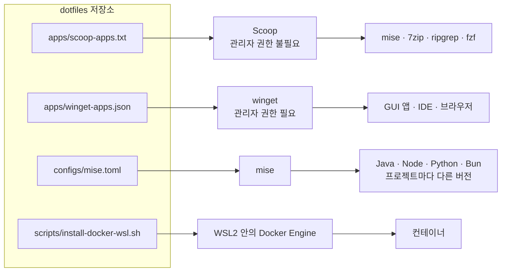

담당자가 넷인 이유는 취향이 아니라 **제약이 넷이기 때문이다.**

| 제약 | 무엇이 문제인가 | 그래서 |
|---|---|---|
| 권한 | 관리형 PC 는 관리자 권한이 없을 수 있다 | 무권한으로 되는 것(Scoop)과 아닌 것(winget)을 분리 |
| 버전 | 프로젝트마다 Java 17 / 21 이 갈린다 | 런타임만 따로 떼어 mise 에 맡김 |
| 라이선스 | Docker Desktop 은 조직 규모에 따라 유료 | 데몬만 직접 설치 |
| 이식성 | Windows 와 macOS 를 함께 쓴다 | OS 별 디렉터리로 분리, 설정 파일은 같은 내용 |

---

## 2. 왜 Scoop 과 winget 을 둘 다 쓰나

**권한이 확정되지 않은 PC** 를 전제로 하기 때문이다.

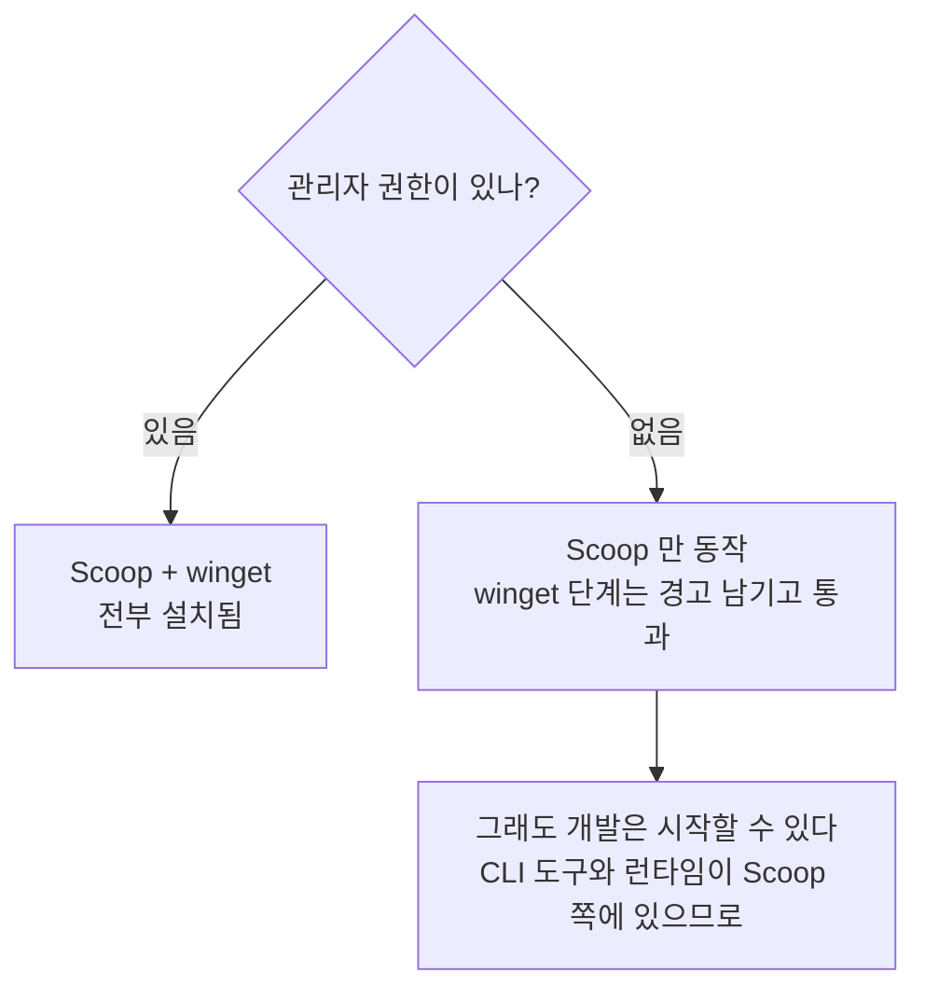

핵심은 **Scoop 단계가 어떤 PC 에서도 실행된다**는 것이다.
그래서 개발에 꼭 필요한 것(mise, ripgrep 등)은 Scoop 목록에 두고,
없어도 당장 일은 되는 것(GUI 앱)은 winget 목록에 둔다.

### git 과 gh 가 목록에 없는 것처럼 보이는 이유

두 도구는 **저장소를 clone 하는 시점에 이미 있어야 한다.** 닭과 달걀이다.
그래서 README 1단계에서 winget 으로 먼저 깔고, 목록에는 재실행 시 상태 추적용으로만 남겼다.

Scoop 목록에는 넣지 않는다. Windows 는 **시스템 PATH 를 사용자 PATH 보다 먼저** 탐색하는데,
winget 은 시스템 PATH 에, Scoop 은 사용자 PATH 에 등록되기 때문이다.
둘 다 깔면 winget 쪽이 계속 쓰이고 Scoop 사본은 쓰이지 않은 채 남는다.

---

## 3. bootstrap 실행 흐름

### Windows

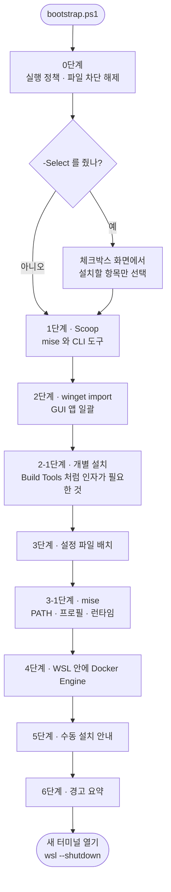

**3단계가 3-1단계보다 먼저인 것이 중요하다.** 3단계가 `mise.toml` 을 배치해야
3-1단계의 `mise install` 이 "무엇을 깔아야 하는지" 알 수 있다.
순서가 뒤바뀌면 아무것도 설치하지 않고 조용히 성공한다.

### macOS

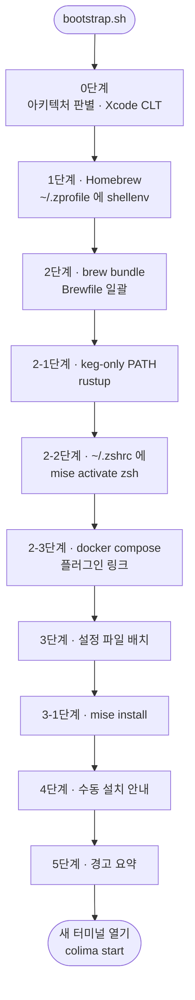

두 흐름의 뼈대는 같다. **패키지 → 셸 배선 → 설정 파일 → 런타임 → 안내.**
차이는 macOS 가 컨테이너 VM 을 사용자가 직접 띄운다는 것뿐이다.

---

## 4. mise 가 버전을 고르는 원리

이 저장소에서 가장 이해가 필요한 부분이다.

### 문제

패키지 매니저는 **언어당 한 버전만** PATH 에 올린다.
Java 17 을 쓰는 저장소와 21 을 쓰는 저장소를 오가려면 매번 다시 깔아야 한다.

### 해결 — shim

**shim** 은 진짜 실행 파일 대신 PATH 에 놓이는 얇은 중계 실행 파일이다.
`java` 를 치면 이런 일이 벌어진다.

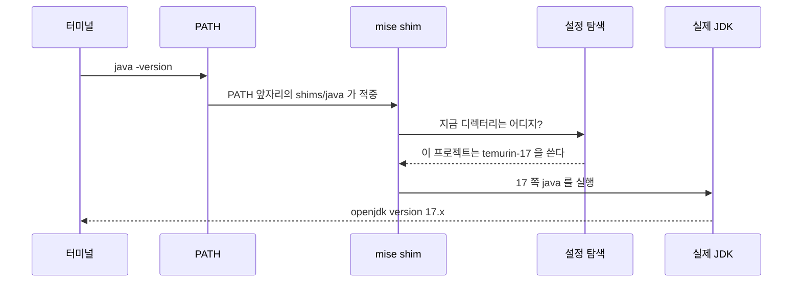

**디렉터리를 옮기는 것만으로 버전이 바뀌는** 이유가 이것이다.
shim 은 매번 새로 판단한다.

### 설정을 찾는 순서

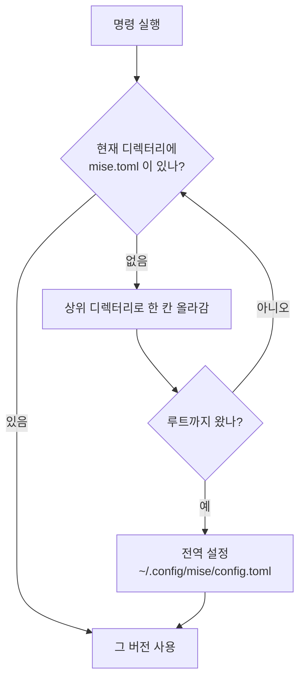

그래서 **프로젝트 루트의 `mise.toml` 은 커밋한다.** 팀원과 CI 가 같은 버전을 쓰게 된다.
개인 오버라이드는 `mise.local.toml` 에 적고 커밋하지 않는다. mise 가 그쪽을 먼저 읽는다.

```bash
mise use java@temurin-17   # 저장소 루트에 mise.toml 을 만든다
mise ls                    # 지금 무엇이 잡혔고 어느 파일이 지정했는지
```

### shim 만으로는 부족한 것 — 환경 변수

shim 은 **명령을 올바른 버전으로 넘겨줄 뿐 환경 변수는 건드리지 않는다.**
`JAVA_HOME` 이 문제가 된다. Gradle 과 Maven 은 `JAVA_HOME` 이 있으면 그 값을 쓰고,
없을 때만 PATH 의 `java` 를 보기 때문이다.

그래서 경로가 둘이다.

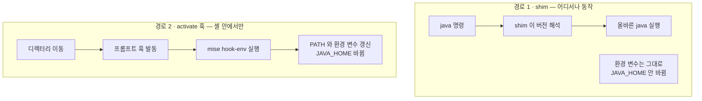

bootstrap 이 셸에 훅을 걸어 두 경로를 모두 확보한다.

| 실행 위치 | shim | activate 훅 | `JAVA_HOME` |
|---|---|---|---|
| PowerShell | 동작 | 동작 | 프로젝트를 따라감 |
| zsh, macOS | 동작 | 동작 | 프로젝트를 따라감 |
| cmd.exe | 동작 | 없음 | 갱신 안 됨 |
| IDE 가 띄운 빌드 프로세스 | 동작 | 없음 | 갱신 안 됨 |

훅은 **프롬프트가 그려질 때** 돈다. 그래서 프롬프트 없이 도는 스크립트에서
디렉터리를 옮긴 직후의 환경 변수는 아직 이전 값일 수 있다. 그럴 때는 `mise x` 로 감싼다.

```bash
mise x -- ./gradlew build
```

훅이 닿지 않는 칸이 있으므로, **`JAVA_HOME` 을 시스템에 고정해 두지 않는 것**이 전제다.
값이 비어 있으면 Gradle 이 PATH 의 shim 으로 내려와 프로젝트 버전을 따라간다.
bootstrap 은 남아 있는 `JAVA_HOME` 을 발견하면 경고한다.

### 헷갈리기 쉬운 것 — 설정과 데이터는 다른 곳에 있다

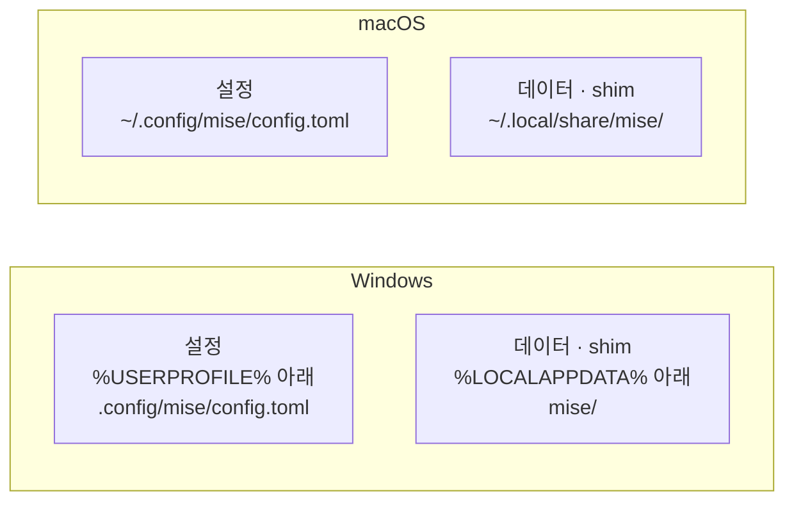

**설정은 양쪽 다 홈 아래**다. Windows 에서 `%LOCALAPPDATA%\mise` 는 설정이 아니라
내려받은 런타임과 shim 이 들어가는 자리다. 여기에 설정을 두면 mise 가 읽지 않아
`mise install` 이 아무것도 설치하지 않고 성공으로 끝난다.
실제 경로는 `mise doctor` 의 `dirs` 항목으로 확인할 수 있다.

### Rust 만 예외

Rust 는 mise 가 아니라 rustup 이 맡는다.
rustup 이 이미 `rust-toolchain.toml` 을 읽어 프로젝트별 전환을 하므로,
mise 까지 끼면 같은 일을 두 곳에서 관리하게 된다.

---

## 5. 컨테이너 — Docker Desktop 을 쓰지 않는 이유

Windows 와 macOS 에는 **리눅스 커널이 없다.** 컨테이너를 그대로 돌릴 수 없다.
어느 방식이든 리눅스 VM 안에서 데몬을 띄우고 호스트의 CLI 가 거기 붙는 구조다.

Docker Desktop 은 그 VM 과 GUI 를 묶어 파는 상용 제품이다.
VM 은 이미 있거나 쉽게 만들 수 있으므로, 데몬만 직접 두면 된다.

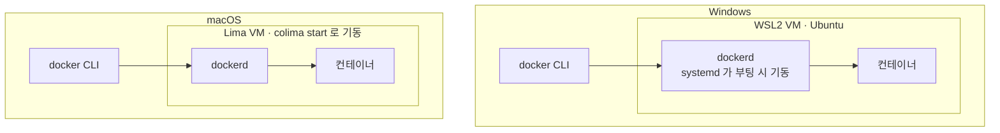

Windows 는 **이미 WSL2 배포판이 있으므로 VM 이 늘지 않는다.**
Docker Desktop 은 프로젝트용 배포판과 별개의 VM 을 하나 더 띄우므로,
이 구성이 자원도 덜 쓴다.

### 설치 스크립트가 하는 네 가지

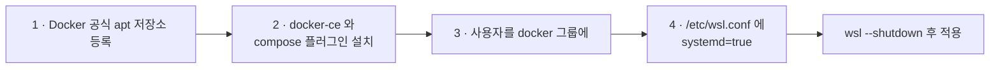

3번과 4번이 왜 필요한지가 포인트다.

- **docker 그룹** — 데몬이 만드는 `/var/run/docker.sock` 이 `root:docker` 소유라,
  그룹에 없으면 `docker` 명령마다 `sudo` 가 붙는다.
- **systemd** — WSL2 는 기본 init 이 systemd 가 아니다. 켜 주지 않으면
  배포판을 열 때마다 `sudo service docker start` 를 손으로 쳐야 한다.

둘 다 **WSL 재시작 후에** 적용된다. 그래서 마지막에 `wsl --shutdown` 이 필요하다.

---

## 6. 파일이 어디로 가나

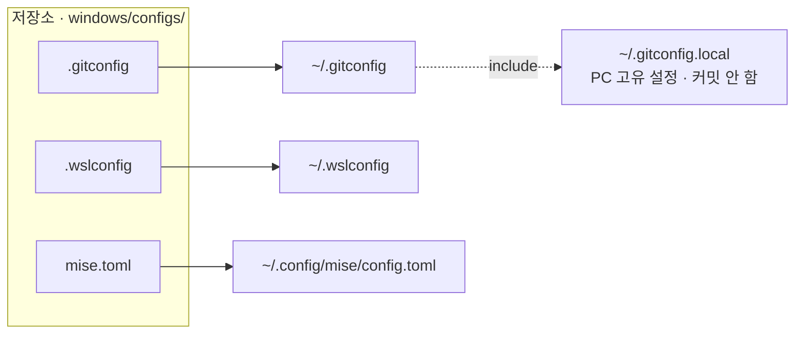

`.gitconfig` 는 **모든 PC 에 공통인 값만** 담는다.
사내 git 서버 credential, `core.hooksPath` 처럼 PC 마다 달라지는 값은
`~/.gitconfig.local` 에 적는다. 커밋되는 `.gitconfig` 마지막 줄의 `[include]` 가
이 파일을 읽고, 없으면 조용히 무시한다.

**같은 키를 다시 정의하면 로컬 값이 이긴다.** 그래서 공통 파일을 덮어써도
PC 고유 설정은 살아남는다.

---

## 7. 여러 번 돌려도 안전한 이유

bootstrap 은 한 번 쓰고 버리는 스크립트가 아니다. 목록에 항목을 추가하고 다시 돌리는 것이
정상 사용법이므로, 모든 단계가 **이미 되어 있으면 건너뛰도록** 만들어져 있다.

| 단계 | 재실행 시 판단 기준 |
|---|---|
| Scoop | 설치된 패키지 목록과 대조 |
| winget | `--no-upgrade` 로 설치된 것은 건너뜀 |
| 개별 설치 | winget 이 아니라 `vswhere` 로 실제 구성 요소 존재를 확인 |
| 설정 파일 | 내용이 같으면 건너뛰고, 다르면 `.bak` 백업 후 교체 |
| mise PATH | 사용자 PATH 에 이미 있는지 확인 |
| 셸 훅 | 프로필에 같은 줄이 있는지 확인 |
| Docker | `dpkg -s docker-ce` 로 패키지 존재 확인 |

판정 기준을 고를 때 **"명령이 있나"가 아니라 "우리가 설치하려던 그것이 있나"** 를 본다.
예를 들어 Docker 는 `command -v docker` 로 보면 안 된다.
Docker Desktop 이 WSL 의 PATH 에 얹은 `docker.exe` 나 구버전 `docker.io` 도 걸리기 때문이다.

**먼저 계획만 확인하는 것이 기본 절차다.**

```powershell
.\bootstrap.ps1 -DryRun          # Windows
```
```bash
./bootstrap.sh --dry-run         # macOS
```

---

## 8. 새 PC 에서 실제로 일어나는 일

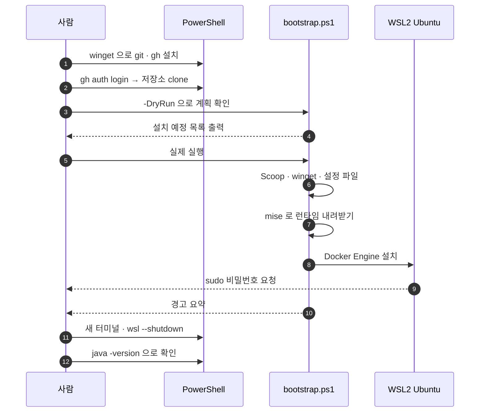

`wsl --shutdown` 이 마지막에 오는 이유는 세 가지가 **한꺼번에** 그때 적용되기 때문이다.
`.wslconfig` 의 자원 제한, `/etc/wsl.conf` 의 systemd, 그리고 docker 그룹 변경.

---

## 9. 어디를 고쳐야 하나

| 하고 싶은 일 | 고칠 파일 |
|---|---|
| CLI 도구 추가 | `windows/apps/scoop-apps.txt` · `mac/Brewfile` |
| GUI 앱 추가 | `windows/apps/winget-apps.json` · `mac/Brewfile` |
| 설치 관리자에 인자가 필요한 패키지 | `windows/apps/winget-overrides.json` |
| 기본 런타임 버전 변경 | 양쪽 `configs/mise.toml` (내용은 동일하게 유지) |
| WSL 자원 상한 | `windows/configs/.wslconfig` |
| 설치되지 않는 앱 안내 추가 | `install-manual-apps.ps1` · `install-manual-apps.sh` |

특정 프로젝트의 런타임 버전은 **이 저장소가 아니라 그 프로젝트에서** 정한다.

```bash
cd 프로젝트
mise use java@temurin-17
```
